# GitHub代码管理教程

::: info 前言
本篇为手把手教学的 Github 代码管理教程，属于新手入门级别的难度。教程简单易操作，能够基本满足读者朋友日常项目寄托于 Github 平台上进行代码管理的需求。Git 与 Github 是一名合格程序员 coder 必定会接触到的工具与平台，GitHub 作为世界上最大的代码开源与分享平台，读者朋友可以在 Github 得到或上传各种各样的代码资源。希望这篇博文能给读者朋友的 Git 与 Github 使用带来些许帮助，Respect！
:::

> Github官网地址：[GitHub](https://github.com/)

## Github概述

### Git的诞生

GitHub 是一个基于web的服务平台，主要用于版本控制和协作，让开发者和项目团队能够更好地一起工作。它提供了一个 Git 代码仓库的托管服务，Git 是一个开源的分布式版本控制系统，由 Linus Torvalds 为更好地管理 Linux 内核开发而设计。

在 GitHub 上，用户可以创建自己的项目仓库来管理代码，同时也可以参与到其他人的项目中。 GitHub 提供了许多协作特性，比如问题跟踪、**项目管理**、代码审查、团队讨论等，这些都极大地促进了开源项目的合作和发展。

> Git 诞生八卦：
> Linus 在 1991 年创建了开源的 Linux，从此，Linux 系统不断发展，已经成为最大的服务器系统软件了。
> Linus 虽然创建了 Linux，但 Linux 的壮大是靠全世界热心的志愿者参与的，这么多人在世界各地为 Linux 编写代码，那 Linux 的代码是如何管理的呢？
> 在 2002 年以前，世界各地的志愿者把源代码文件通过 diff 的方式发给 Linus，然后由 Linus 本人通过手工方式合并代码！
> 直到 2002 年，Linux 系统已经发展了十年了，代码库之大让 Linus 很难继续通过手工方式管理了，社区的弟兄们也对这种方式表达了强烈不满，于是Linus选择了一个商业的版本控制系统 BitKeeper，BitKeeper 的东家 BitMover 公司出于人道主义精神，授权 Linux 社区免费使用这个版本控制系统。
> 但在 2005 年这样的美好被打破了，于是 Linus 花了两周时间自己用 C 写了一个分布式版本控制系统，这就是 Git！一个月之内，Linux 系统的源码已经由 Git 管理了！
> Git 迅速成为最流行的分布式版本控制系统，尤其是 ***2008 年，GitHub 网站上线了，它为开源项目免费提供 Git 存储，无数开源项目开始迁移至 GitHub，包括 jQuery，PHP，Ruby 等等。***

### Git与Github的联系

Git 和 GitHub 是两个紧密相关的事物：

1. **Git**: `Git` 是一个开源的分布式版本控制系统，由 `Linus Torvalds` 创建于 2005 年。它允许开发者跟踪和管理源代码历史，支持多人协作开发。Git 的核心功能包括版本控制、分支管理、合并和冲突解决等。它是基于命令行的工具，可以在本地计算机上完全离线工作。
2. **GitHub**: `GitHub` 是一个基于 `Git` 的在线托管平台，提供 `Git` 仓库的托管服务。它为开源项目和个人开发者提供了一系列协作工具，如代码审查、问题跟踪、项目管理、`Wiki` 页面等。`GitHub` 还提供了图形用户界面，使得用户可以更容易地使用`Git`的功能。此外，`GitHub `还提供了一些社交网络特性，如关注其他用户、星标项目（`star`）、对项目代码提出改进建议（`fork`）和提交拉取请求（`pull request`）。

综上所述，`Git` 是一个版本控制系统，而 `GitHub` 是一个使用 `Git` 的工具和服务提供者。开发者可以在本地使用 `Git` 进行版本控制，然后将代码推送到 `GitHub` 上进行共享和协作。

## Github的使用

### Github注册登录

1. 登入 GitHub 的官网，点击 sign up（注册）


2. 填入相关的注册 GitHub 账号信息

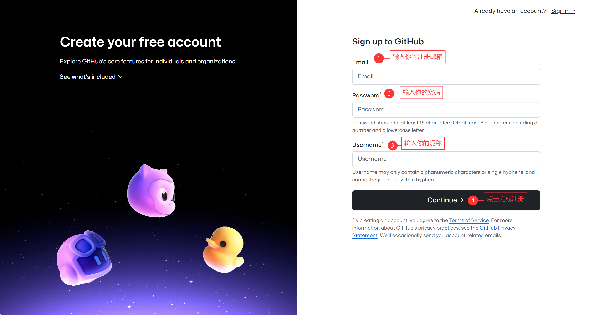

3. 登入自己刚刚注册的 Github 账号


### Github项目库创建

1. 登入自己的 Github，点击 ==new== 进入创建项目页面

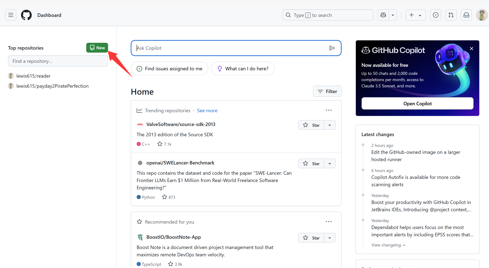

2. 按下图创建一个项目

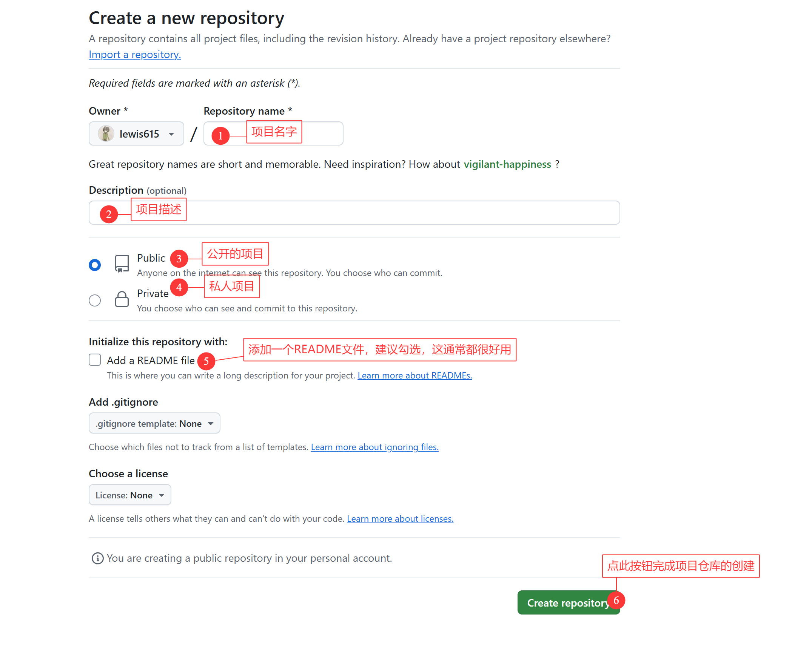

::: tip 注意：
库分为两种，分别是：公有（`Public`）和私有（`Private`），大家自行选择即可
:::

在创建完成自己的库之后，下面就要让自己的电脑克隆一个自己所创建的库，方面自己电脑上的代码同步到 **GitHub **你所创建的库当中。为了实现，就需要安装一个软件** Git Bash**。接下来让我们安装 **Git Bash**。

## 安装Git Bash

点击下方链接进入安装git教程

* [Windows](https://wiki.i615.cn/Studynotes/git/1-1.html)

## Git和Github的绑定

### **得到ssh keys**

输入

```bash
cd ~/.ssh
```

返回 "`no such file or directory`" 表明电脑没有`ssh key`，需要创建`ssh key`

在终端输入

```bash
ssh-keygen -t rsa -C “git账号”；
```

连续进行 3 次回车Enter（确认），得到如下截图中的信息即可；

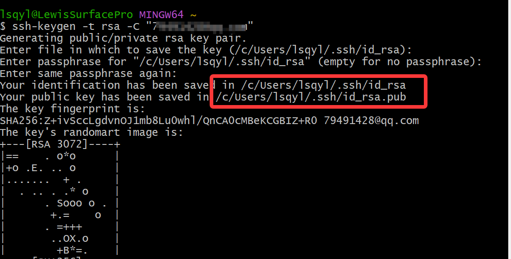

按路径进入 .ssh，里面存储的是两个 **ssh key** 的秘钥，**id_rsa.pub** 文件里面存储的是公钥，**id_rsa** 文件里存储的是私钥， ==不能告诉别人。==  **打开id_rsa.pub文件，复制里面的内容。**

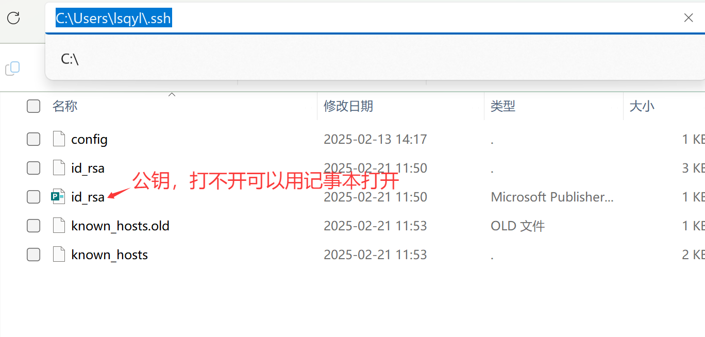

### 绑定ssh密钥

接下需要登录到自己的 GitHub 上边添加这个密匙

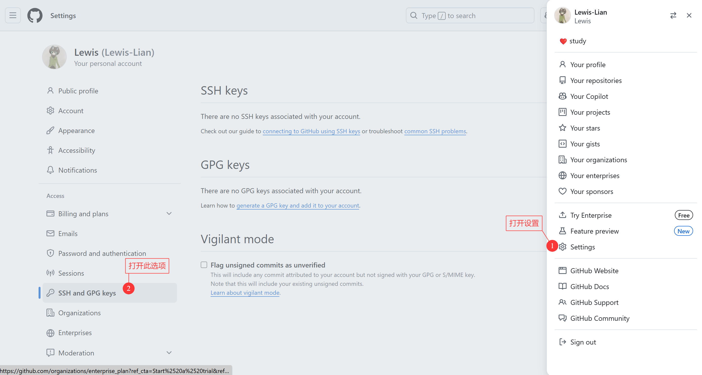
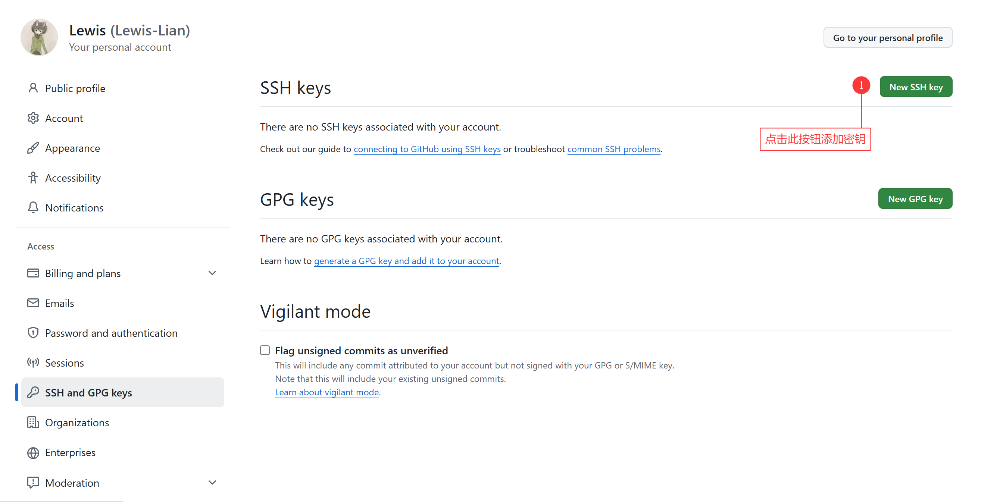

填写名字并且填写复制的公钥（id_rsa.pub内容），添加后配置完成

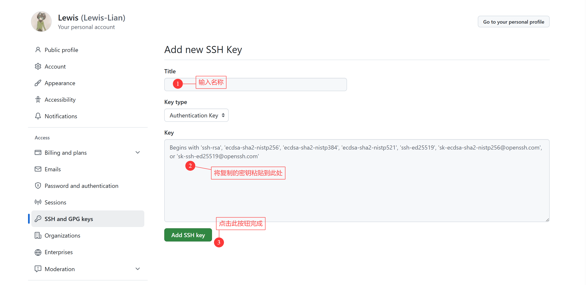

完成后如下图

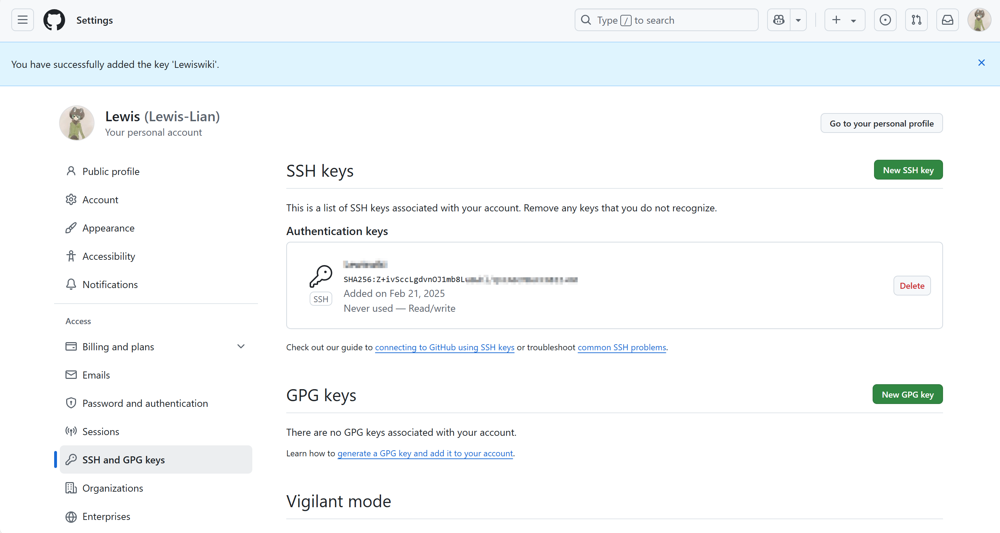

我们回到 **Git bash** 上边，输入：

```bash
ssh -T git@github.com
```

来检查是否成功绑定。如果输入代码之后再选择 yes 出来是这样说明就成功啦！！！

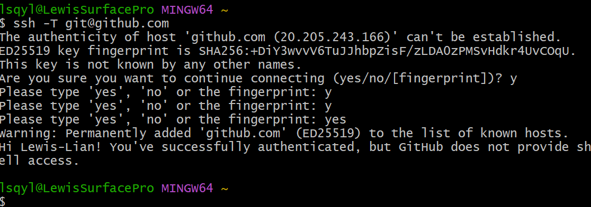

### 剩余配置内容

将 name 最好和 GitHub 上边的一样，email 是一定要是注册 GitHub 的那个邮箱地址

这两个的顺序可以颠倒，没有固定的顺序。

```bash
git config --global user.name “gitname”
```

```bash
git config --global user.email “git邮箱”
```

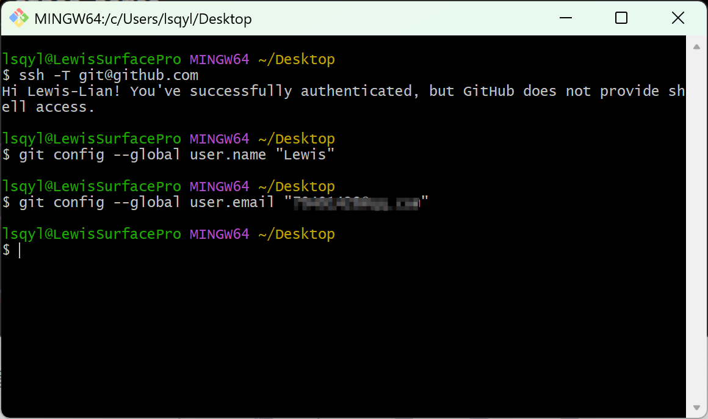

截止到这里的操作，已经完成本地 Git 与远程的 Github 绑定，这意味着我们已经可以通过 Git 向 GitHub 提交代码啦！

## 使用Git将代码提交到GitHub

> 该过程需要使用经常的接触的两个 Git 命令，包括：**`push`**和** `pull`**

**`push`：**该单词直译过来就是 “推” 的意思，如果我们本地的代码有了更新，为了保持本地与远程的代码同步，我们就需要把本地的代码推到远程的仓库，代码示例：

```bash
git push origin master
```

**`pull`** ：该单词直译过来就是 “拉” 的意思，如果我们远程仓库的代码有了更新，同样为了保持本地与远程的代码同步，我们就需要把远程的代码拉到本地，代码示例：

```bash
git pull origin master
```

### **克隆仓库**

将我们的库克隆下来到本地电脑中，方便以后进行上传代码。

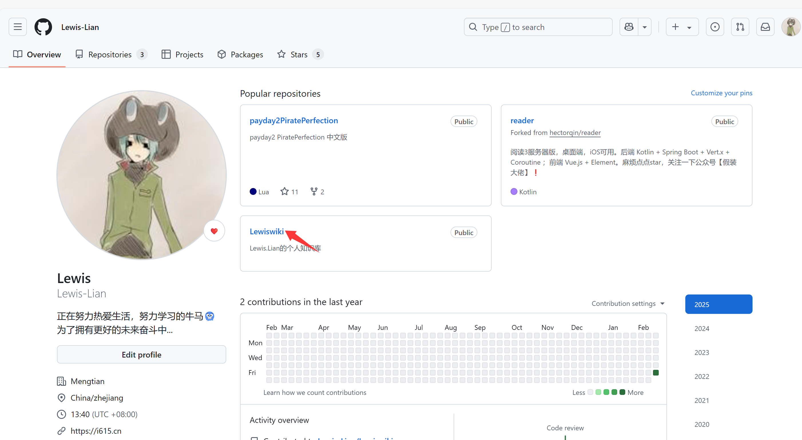

点进仓库之后点击 Code，点击 ssh 会看到一串网址（http也可以），这个地址就是代码地址，git clone 命令会用的到。

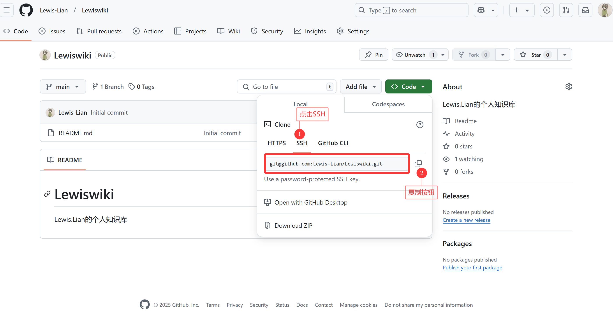

接下来我们就开始选择文件存储地方了，在本地电脑中找到存储文件的地方，然后右键选择 Git Bash Here

在终端输入 git clone 地址（这个地址就是刚刚库那个Code的上代码地址）例如：

```
git clone https://github.com/Lewis-Lian/Lewiswiki
```

该过程有时候可能会需要输入 Github 账号密码啥的，记得不要输错啦！

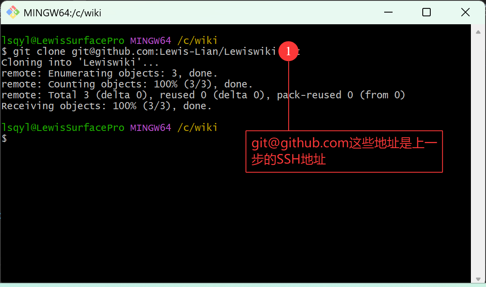

如下图所示，指定目录已经存在了我们的库文件

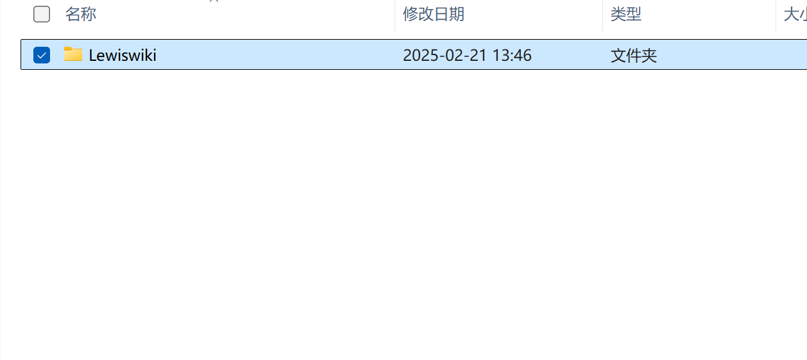

### 上传代码

打开这个文件夹，然后在其中创建一个任意格式，任意名称的文件（这里新建了一个测试文件）。

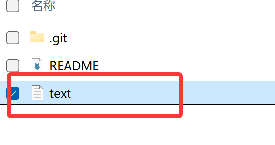

在这个文件夹里面右键`git bash`进终端输入

`git add`我们新增的文件

注意:add有多种形式，可以add某个文件，某个文件夹，或直接add当前仓库下所有文件

```
git add 单个文件
git add 文件夹1/ 文件夹2/ ……多个文件夹之间空格隔开
git add .
```

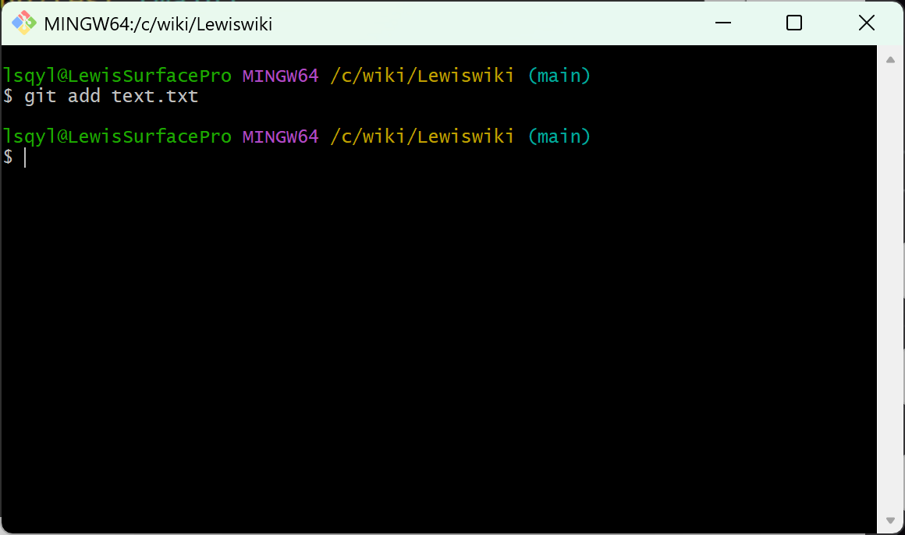

之后输入

```bash
git commit -m "测试是否成功"
```

引号内的内容可以随意改动，这个语句的意思是 给你刚刚上传的文件一个备注，方便查找记忆而已；

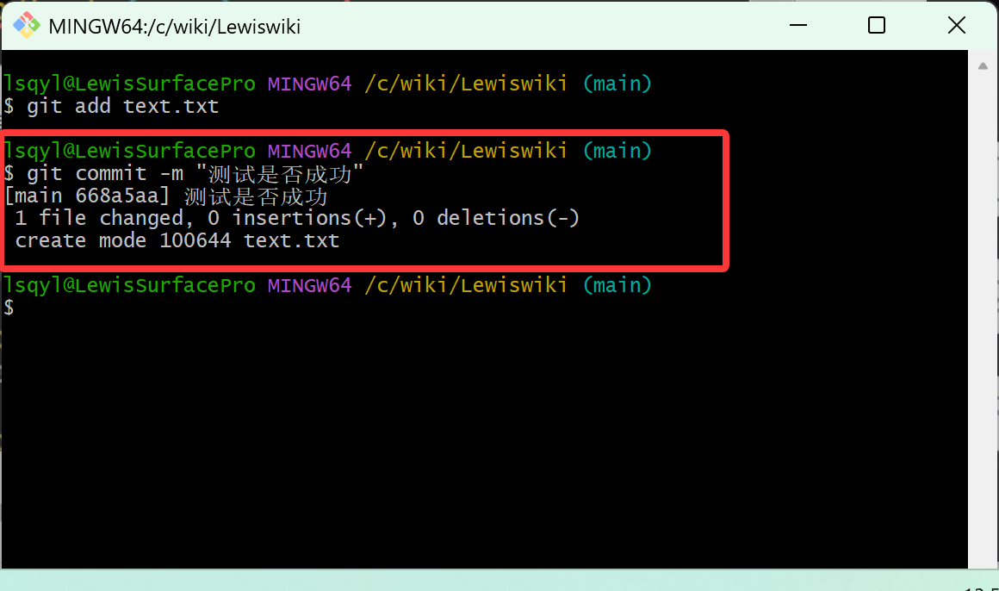

接着输入 push 指令

```bash
git push origin main
```

如下图所示就代表成功了；

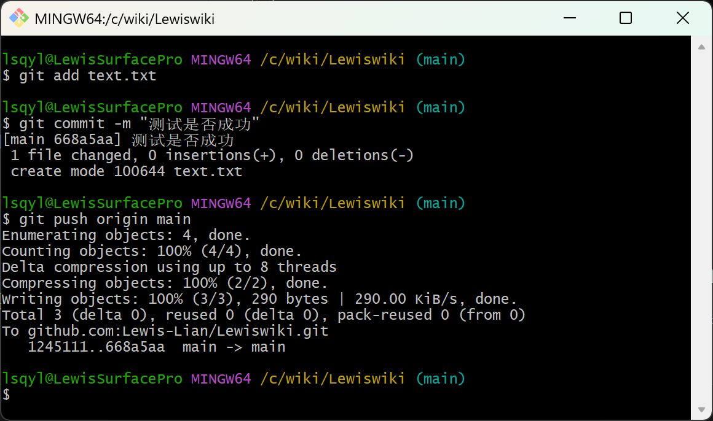

打开 GitHub，看到刚刚上传的文件，显示成功。

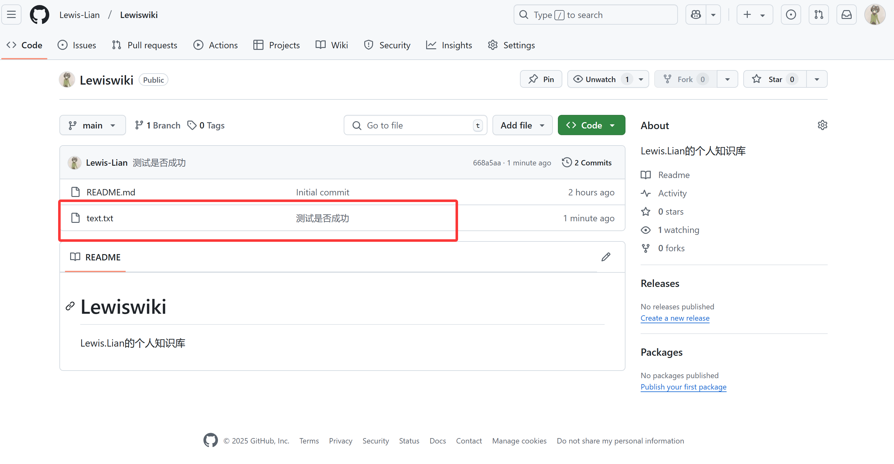

## 参考链接

1. [Git基本使用教程（一）：入门及第一次基本完整操作_git的使用-CSDN博客](https://blog.csdn.net/qq_35206244/article/details/97698815)

