## window系统安装java

### 下载JDK

首先我们需要下载 java 开发工具包 JDK，下载地址：[Java Downloads | Oracle 中国](https://www.oracle.com/cn/java/technologies/downloads/)，在下载页面中根据自己的系统选择对应的版本，本文以 Window 64位系统为例：

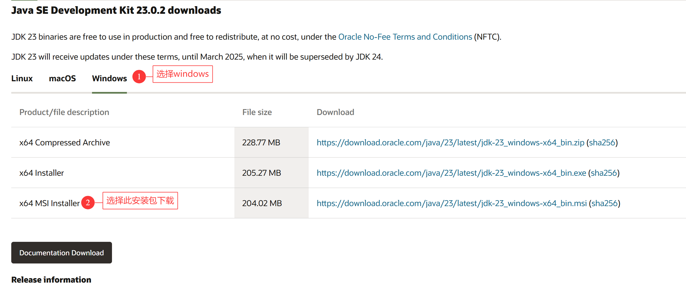

下载后 JDK 的安装根据提示进行，还有安装 JDK 的时候也会安装 JRE，一并安装就可以了。

安装JDK，安装过程中可以自定义安装目录等信息

### 配置环境变量

安装完成后，右击"我的电脑"，点击"属性"，选择"高级系统设置"

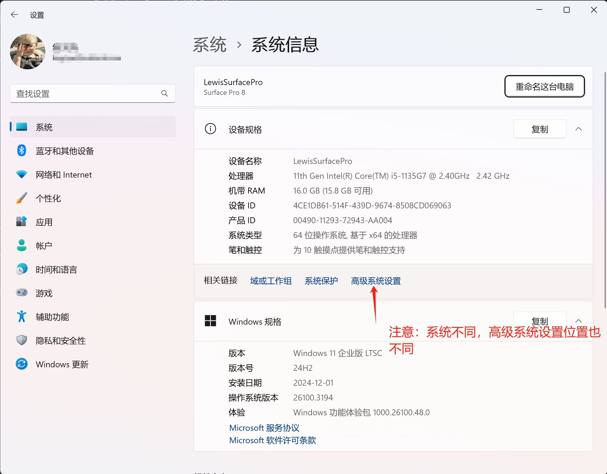

选择"高级"选项卡，点击"环境变量"；

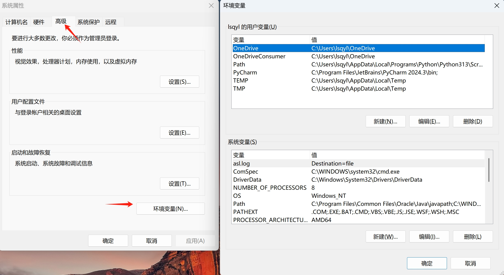

在 "系统变量" 中设置 3 项属性，JAVA_HOME、PATH、CLASSPATH(大小写无所谓),若已存在则点击"编辑"，不存在则点击"新建"。

::: tip 注意

如果使用 1.5 以上版本的 JDK，不用设置 CLASSPATH 环境变量，也可以正常编译和运行 Java 程序。

:::

变量设置参数如下：

```
变量名：JAVA_HOME
变量值：C:\Program Files (x86)\Java\jdk1.8.0_91
// 要根据自己的实际路径配置

变量名：CLASSPATH
变量值：
.;%JAVA_HOME%\lib\dt.jar;%JAVA_HOME%\lib\tools.jar;
//记得前面有个"."
变量名：Path
变量值：%JAVA_HOME%\bin;%JAVA_HOME%\jre\bin;
```

### JAVA_HOME 设置

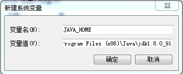

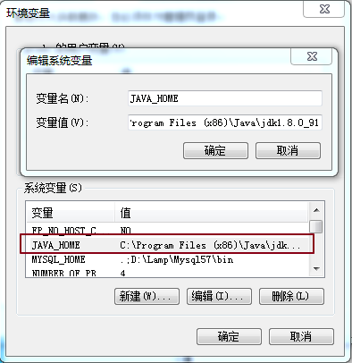

### PATH设置

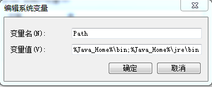

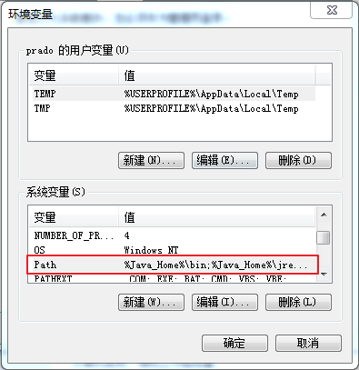

::: tip 注意

在 Windows10 中，Path 变量里是分条显示的，我们需要将 %JAVA_HOME%\bin;%JAVA_HOME%\jre\bin; 分开添加，否则无法识别:

```
%JAVA_HOME%\bin;
%JAVA_HOME%\jre\bin;
```

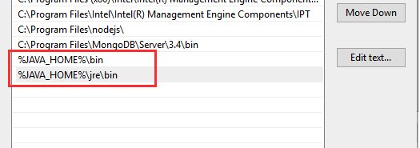

:::

### CLASSPATH 设置

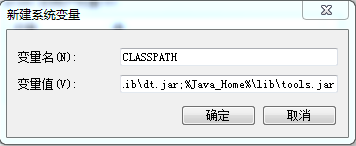

这是 Java 的环境配置，配置完成后，你可以启动 Eclipse 来编写代码，它会自动完成java环境的配置。

### 测试JDK是否安装成功

1. "开始"->"运行"，键入"cmd"；
2. 键入命令: `java -version` 、`java` 、`javac` 几个命令，出现以下信息，说明环境变量配置成功；

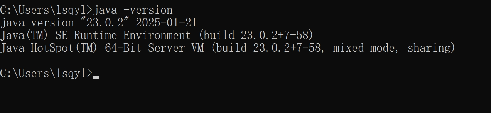

## Linux，UNIX，Solaris，FreeBSD环境变量设置

环境变量PATH应该设定为指向Java二进制文件安装的位置。如果设置遇到困难，请参考shell文档。

例如，假设你使用bash作为shell，你可以把下面的内容添加到你的 .bashrc文件结尾: `export PATH=/path/to/java:$PATH`

## 流行 Java 开发工具

正所谓工欲善其事必先利其器，我们在开发 Java 语言过程中同样需要一款不错的开发工具，目前市场上的 IDE 很多，本文为大家推荐以下下几款 Java 开发工具：

* **JetBrains** 的 IDEA， 现在很多人开始使用了，功能很强大,下载地址：[https://www.jetbrains.com/idea/download/](https://www.jetbrains.com/idea/download/)

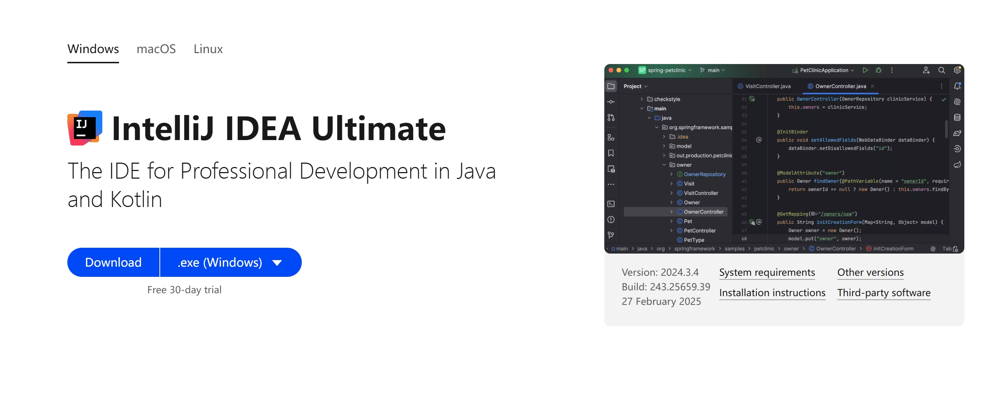

* **VSCode** : `VSCode`（全称：`Visual Studio Code`）是一款由微软开发且跨平台的免费源代码编辑器。下载地址：[https://code.visualstudio.com/](https://code.visualstudio.com/)

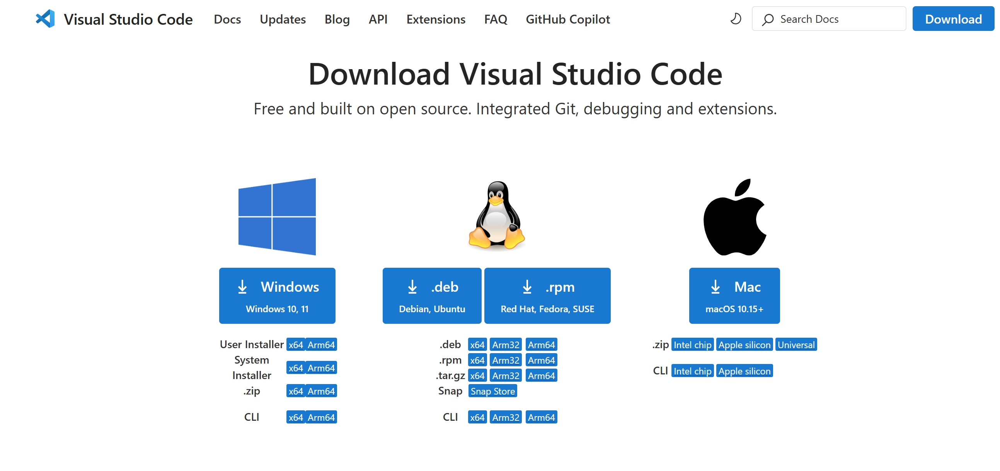

* **Eclipse:** 另一个免费开源的 Java IDE，下载地址： [https://www.eclipse.org/downloads/packages/](https://www.eclipse.org/downloads/packages/)

选择 `Eclipse IDE for Java Developers`：

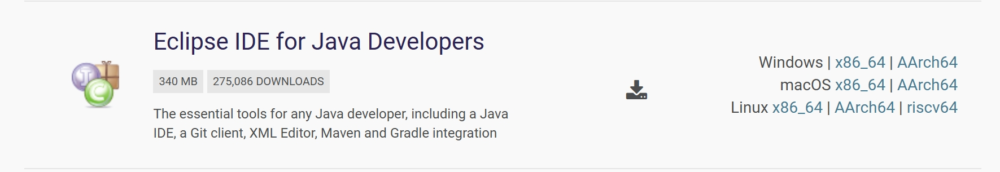


