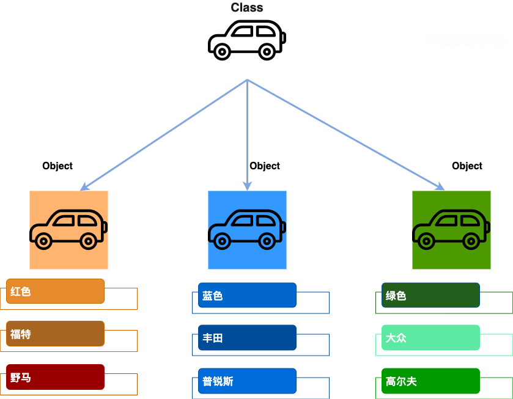

# Java 对象和类

Java 作为一种面向对象的编程语言，支持以下基本概念：

1. 类（Class） ：

* 定义对象的蓝图，包括属性和方法。
* 示例：`public class Car { ... }`

2. 对象（Object） ：

* 类的实例，具有状态和行为。
* 示例：`Car myCar = new Car();`

3. 继承（Inheritance） ：

* 一个类可以继承另一个类的属性和方法。
* 示例：`public class Dog extends Animal { ... }`

4. 封装（Encapsulation） ：

* 将对象的状态（字段）私有化，通过公共方法访问。
* 示例：

```java
private String name; 
public String getName() { return name; }
```

5. 多态（Polymorphism） ：

* 对象可以表现为多种形态，主要通过方法重载和方法重写实现。
* 示例：
  * 方法重载：`public int add(int a, int b) { ... }` 和 `public double add(double a, double b) { ... }`
  * 方法重写：`@Override public void makeSound() { System.out.println("Meow"); }`

6. 抽象（Abstraction） ：

* 使用抽象类和接口来定义必须实现的方法，不提供具体实现。
* 示例：
  * 抽象类：`public abstract class Shape { abstract void draw(); }`
  * 接口：`public interface Animal { void eat(); }`

7. 接口（Interface） ：

* 定义类必须实现的方法，支持多重继承。
* 示例：`public interface Drivable { void drive(); }`

8. 方法（Method） ：

* 定义类的行为，包含在类中的函数。
* 示例：`public void displayInfo() { System.out.println("Info"); }`

9. 方法重载（Method Overloading） ：

* 同一个类中可以有多个同名的方法，但参数不同。
* 示例：

```java
public class MathUtils {
    public int add(int a, int b) {
        return a + b;
    }

    public double add(double a, double b) {
        return a + b;
    }
}
j
```

本节我们重点研究对象和类的概念。

* **对象** ：对象是类的一个实例，有状态和行为。例如，一条狗是一个对象，它的状态有：颜色、名字、品种；行为有：摇尾巴、叫、吃等。
* **类** ：类是一个模板，它描述一类对象的行为和状态。

下图中**男孩（boy）** 、**女孩（girl）** 为**类（class）** ，而具体的每个人为该类的**对象（object）** ：


下图中**汽车** 为**类（class）** ，而具体的每辆车为该**汽车** 类的**对象（object）** ，对象包含了汽车的颜色、品牌、名称等。




## Java中的对象

现在让我们深入了解什么是对象。看看周围真实的世界，会发现身边有很多对象，车，狗，人等等。所有这些对象都有自己的状态和行为。

拿一条狗来举例，它的状态有：名字、品种、颜色，行为有：叫、摇尾巴和跑。

对比现实对象和软件对象，它们之间十分相似。

软件对象也有状态和行为。软件对象的状态就是属性，行为通过方法体现。

在软件开发中，方法操作对象内部状态的改变，对象的相互调用也是通过方法来完成。

## Java 中的类

类可以看成是创建 Java 对象的模板。


通过上图创建一个简单的类来理解下 Java 中类的定义：

```java
public class Dog {
    String breed;
    int size;
    String colour;
    int age;
 
    void eat() {
    }
 
    void run() {
    }
 
    void sleep(){
    }
 
    void name(){
    }
}
```

一个类可以包含以下类型变量：

* **局部变量** ：在方法、构造方法或者语句块中定义的变量被称为局部变量。变量声明和初始化都是在方法中，方法结束后，变量就会自动销毁。
* **成员变量** ：成员变量是定义在类中，方法体之外的变量。这种变量在创建对象的时候实例化。成员变量可以被类中方法、构造方法和特定类的语句块访问。
* **类变量** ：类变量也声明在类中，方法体之外，但必须声明为 static 类型。

一个类可以拥有多个方法，在上面的例子中：`eat()`、`run()`、`sleep()` 和 `name()` 都是 Dog 类的方法。

## 构造方法

每个类都有构造方法。如果没有显式地为类定义构造方法，Java 编译器将会为该类提供一个默认构造方法。

在创建一个对象的时候，至少要调用一个构造方法。构造方法的名称必须与类同名，一个类可以有多个构造方法。

下面是一个构造方法示例：

```java
public class Puppy{
    public Puppy(){
    }
 
    public Puppy(String name){
        // 这个构造器仅有一个参数：name
    }
}
```

## 创建对象

对象是根据类创建的。在Java中，使用关键字 new 来创建一个新的对象。创建对象需要以下三步：

* **声明** ：声明一个对象，包括对象名称和对象类型。
* **实例化** ：使用关键字 new 来创建一个对象。
* **初始化** ：使用 new 创建对象时，会调用构造方法初始化对象。

下面是一个创建对象的例子：

```java
public class Puppy{
   public Puppy(String name){
      //这个构造器仅有一个参数：name
      System.out.println("小狗的名字是 : " + name ); 
   }
   public static void main(String[] args){
      // 下面的语句将创建一个Puppy对象
      Puppy myPuppy = new Puppy( "tommy" );
   }
}
```

编译并运行上面的程序，会打印出下面的结果：

```java
小狗的名字是 : tommy
```

## 访问实例变量和方法

通过已创建的对象来访问成员变量和成员方法，如下所示：

```java
/* 实例化对象 */
Object referenceVariable = new Constructor();
/* 访问类中的变量 */
referenceVariable.variableName;
/* 访问类中的方法 */
referenceVariable.methodName();
```

使用 Object 类型声明变量只能在编译时访问 Object 类中的方法和属性，但在运行时，你可以通过强制类型转换将其转换为特定类型，以便访问特定类型的方法和属性。

## 实例

下面的例子展示如何访问实例变量和调用成员方法：

```java
public class Puppy {
    private int age;
    private String name;
 
    // 构造器
    public Puppy(String name) {
        this.name = name;
        System.out.println("小狗的名字是 : " + name);
    }
 
    // 设置 age 的值
    public void setAge(int age) {
        this.age = age;
    }
 
    // 获取 age 的值
    public int getAge() {
        return age;
    }
 
    // 获取 name 的值
    public String getName() {
        return name;
    }
 
    // 主方法
    public static void main(String[] args) {
        // 创建对象
        Puppy myPuppy = new Puppy("Tommy");
 
        // 通过方法来设定 age
        myPuppy.setAge(2);
 
        // 调用另一个方法获取 age
        int age = myPuppy.getAge();
        System.out.println("小狗的年龄为 : " + age);
 
        // 也可以直接访问成员变量（通过 getter 方法）
        System.out.println("变量值 : " + myPuppy.getAge());
    }
}
```

编译并运行上面的程序，产生如下结果：

```JAVA
小狗的名字是 : tommy
小狗的年龄为 : 2
变量值 : 2
```


